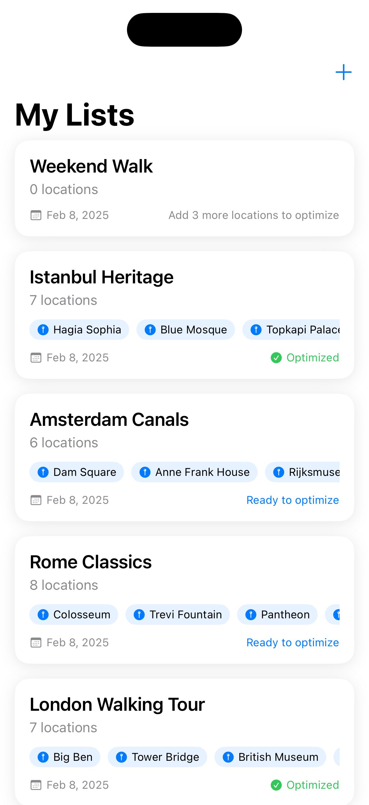

# WalkBetter

This app is experimental and not ready for production. I'm learning SwiftUI, SwiftData and AI usage by building this app.


WalkBetter is an iOS app that helps you plan and optimize walking routes between multiple locations. Whether you're planning a city tour, a shopping trip, or just want to explore efficiently, WalkBetter helps you find the best path.

## Features

- 🗺️ **Location Search**: Search for locations using Apple's Maps service
- 📍 **Current Location**: Use your current location as a starting or destination point
- 📝 **Multiple Lists**: Create and manage multiple walking route lists
- 🎯 **Route Optimization**: Automatically find the most efficient path between locations
- 🚶‍♂️ **Navigation**: Open optimized routes in Apple Maps or Google Maps

## Requirements

- iOS 17.0+
- Xcode 15.0+
- Swift 5.9+

## Installation

1. Clone the repository:
```bash
git clone https://github.com/yourusername/WalkBetter.git
```

2. Open `WalkBetter.xcodeproj` in Xcode

3. Build and run the project

## Usage

1. **Create a List**
   - Tap the "+" button to create a new walking route list
   - Give your list a memorable name

2. **Add Locations**
   - Add locations by searching or using your current location
   - Add up to 15 locations per list
   - Minimum 3 locations needed for optimization

3. **Optimize Route**
   - Once you have at least 3 locations, tap "Optimize Walking Route"
   - The app will calculate the most efficient path

4. **Navigate**
   - Preview the optimized route on the map
   - Open in Apple Maps or Google Maps for turn-by-turn navigation

## Architecture

- **SwiftUI**: Modern declarative UI framework
- **SwiftData**: Persistent storage using Apple's latest data framework
- **MapKit**: Location services and map functionality

## Privacy

WalkBetter takes user privacy seriously:
- No personal data is collected or shared
- All data is stored locally on your device

## License

This project is licensed under the GPL-3.0 License - see the [LICENSE](LICENSE) file for details.

## Acknowledgments

- [MapKit](https://developer.apple.com/documentation/mapkit/) for location services
- [SwiftData](https://developer.apple.com/documentation/swiftdata) for data persistence
- [SwiftUI](https://developer.apple.com/xcode/swiftui/) for the modern UI framework

## Contact

Mustafa Turhan - [@mustaphaturhan](https://twitter.com/mustaphaturhan)

## Possible Future Improvements

- 🗺️ **Alternative Routing Services**:
  - [ ] Support for Project OSRM for custom routing
  - [ ] Integration with additional mapping services
  - [ ] Custom routing algorithms implementation

- 🎯 **Enhanced Optimization**:
  - [ ] Multiple optimization algorithms to choose from
  - [ ] Time-based route planning
  - [ ] Consider elevation data in route planning

- 📱 **User Experience**:
  - [ ] Customizable route colors and styles
  - [ ] Dark mode support for map view
  - [ ] Route sharing capabilities
  - [ ] Import locations from files

- 🔄 **Sync & Backup**:
  - [ ] iCloud sync support
  - [ ] Export/Import lists
  - [ ] Backup and restore functionality

- 📊 **Advanced Features**:
  - [ ] Route statistics and analytics
  - [ ] Points of interest along routes
  - [ ] Weather integration for route planning

- 👥 **Social Features**:
  - [ ] Share routes with other users
  - [ ] Import routes from other users
  - [ ] Rate and review shared routes
  - [ ] Comments and tips on routes
  - [ ] Follow other users' route collections
  - [ ] Collaborative route planning
  - [ ] Community challenges and events

## Screenshots

<table>
  <tr>
    <td></td>
    <td></td>
    <td></td>
  </tr>
</table>

---
Made with ❤️ using SwiftUI and AI.
